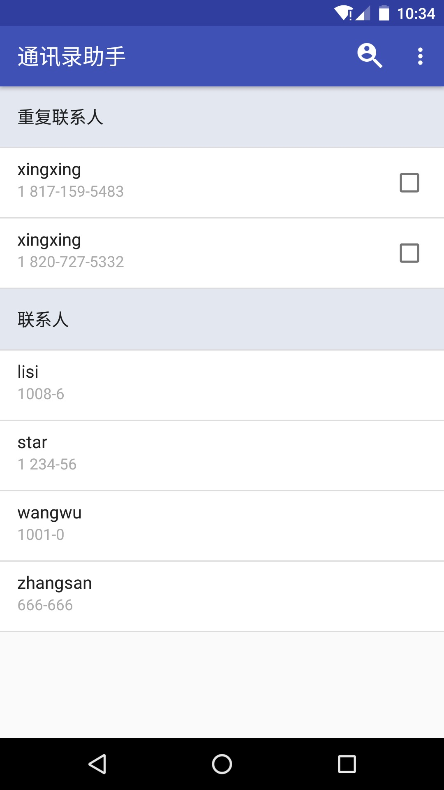
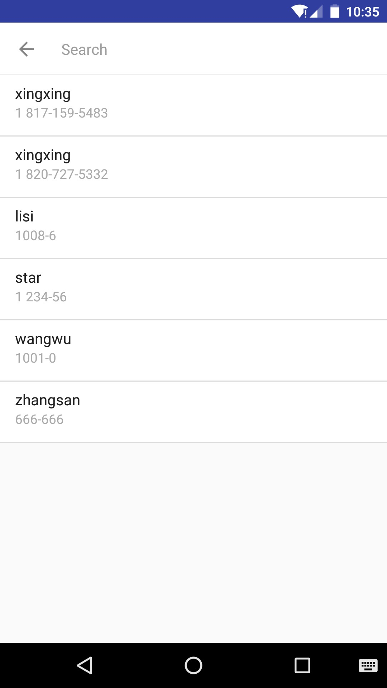
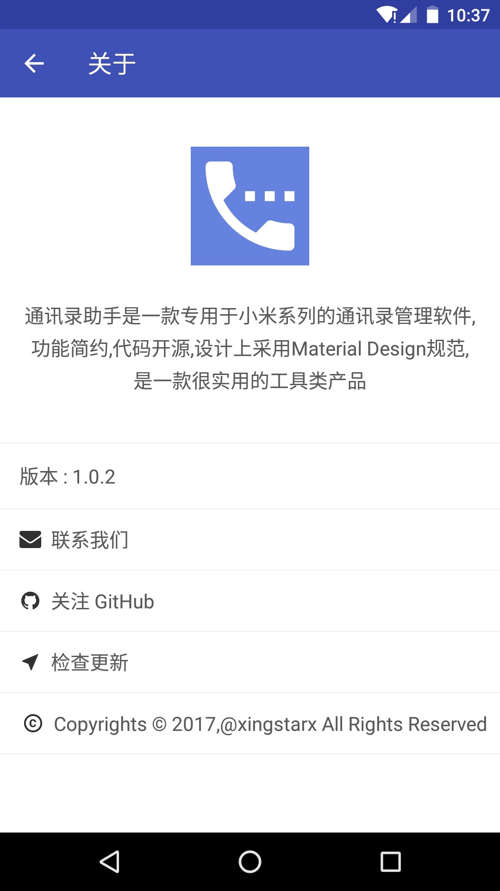

# XiaoMiContactsHelper
用来清理小米系列手机上联系人重复的工具

## 效果

## 目的
写这个app的目的，最主要的就是为了删除小米手机上的重复的联系人。也是为了用的省心。

吐槽一下，小米手机联系人的问题。

1. 当联系人太多的时候，删除起来特别麻烦，默认情况下，只能一条一条的删除。
2. 如果是从小米手机的设置 --> 系统应用 --> 联系人 是可以进行批量删除的，但是存在一个问题，这个列表只显示用户名，而不显示电话，这样我删除起来多费力呢。
3. 如果还包括重复的联系人呢。我怎么知道我删除的是对的，这样用起来不是很坑爹吗。

为了解决这个问题，于是写了这个app，希望能够帮助到需要帮助的人。

## 开发中碰到的问题

### 小米手机联系人删除限制
除了小米自己的联系人app可以删除联系人数据，其他的第三方的app都没有办法删除联系人数据（如微信电话本，qq通讯录，其他的app没有测试过，理论上也不行(只要是按照Android规范上的API来删除联系人，都会被小米的拦截机制拦截)）

通过电脑上的豌豆荚删除的其实是data表中的数据，而没有删除contacts表，raw_contacts表

小米自己的一个小米助手工具，是可以用来删除干净一条联系人记录所关联的三个表的数据的，但是还没有分析清楚它实现的手段。

### 统一删除规则
先删除data表的记录，在xiaomi手机上不会被拦截，后面的contact表，raw_contact表删除记录在xiaomi上会被拦截,(由于data表中已经没有了记录，通过api查询的时候，这条联系人是显示不出来的，算是取巧的达到了删除的目的，但是本质上，这条联系人数据在contact，raw_contact里面还是有的。)

对于不是在xiaomi手机上的，按照这个流程删除，是没有问题的。

## 目前支持的功能

1. 首页按照重复联系人和非重复联系人排列（是否重复的逻辑是根据名字来判断的），以及删除功能
2. 搜索页支持按照电话号码，名字模糊搜索
3. 可以直接在首页和搜索页的item项中点击就拨打电话(v1.0.1支持) (我爸提的需求)

## 需要了解的技术细节

需要知道的是，contacts2.db里面的几张表，data，contact，raw_contact。 一个联系人，比如说 zhangsan 663563, 这条数据，会在data表里面存放两条记录，一条是mimeType是名字类型，一条是mimeType是电话类型的。然后contact表有一条记录，raw_contact有一条记录。

定义的重复联系人，指的是名字重复的。比如说，我有一个联系人，feng 18207279353,他还有一个短号 669353，这两个都是他的，这个记录在数据库的表现形式是data表里面存放三条记录，一条mimeType是名字类型的，两条mimeType是电话类型的，然后是contact表有一条记录，raw_contact有一条记录。

如果feng 哪天毕业了，重新换了一个工作的号，在我的通讯录中，又添加了一个新的联系人叫 feng 18171595428， 那么在数据库中表现为data表里面存放两条记录，一条是mimeType是名字类型，一条是mimeType是电话类型的。然后contact表有一条新的记录，raw_contact有一条新的记录（跟上面的feng 18207279353没有一点关系）。

那么，在我的定义重复里面，这三个号都是重复的，无论是两个联系人同名，还是同一个联系人有多个电话，都定义为重复联系人

删除规则中，先删除data表中的电话，如果这个电话不是属于同一个联系人有多个电话这种类型的，就直接删除对应的contact,raw_contact表中的数据；属于的话，就只删除data表中的数据。

具体的可以看看项目的代码，也包括issue中的问题，欢迎讨论。